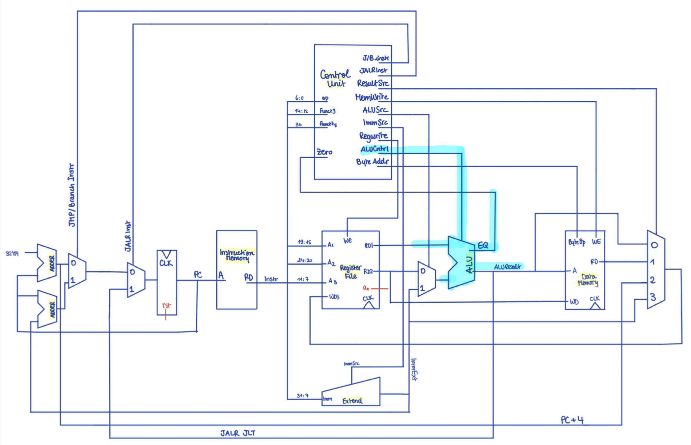

## ALU

Alu schematics and where it positions in the overall cpu:

 *schemetic drawn by Sara, highlighted by Lu

<br>

The Arithmetic Logic Unit `ALU` is at the heart of the execute stage of every CPU.

Our first design of that component only supports two rudimentary instructions, `ADDI` and `BNE`.

This design - however -  has to be extended to support a wider set of instructions. This is only possible by working closely with the `ControlUnit` team, and agreeing on appending one bit to the `ALUControl` signal such as:

| `ALUControl`    | Operation | SystemVerilog Code |
|  ------------ |------------------- | --- |
| `4'b0000`    | Add | `srcA + srcB` |
| `4'b0001`    | Shift Left Logical | `srcA << srcB` |
| `4'b0010`    | Set Less Than | `(srcA < srcB)` |
| `4'b0011`    | Set Less Than | `(srcA < srcB)` |
| `4'b0100`    | XOR | `srcA ^ srcB` |
| `4'b0101`    | Shift Right Logical | `srcA >> srcB` |
| `4'b0110`    | OR | `srcA / srcB` |
| `4'b0111`    | AND | `SrcA & srcB` |
| `4'b1101`    | Shift Right Arithmetic | `srcA >>> srcB`

This new configuration introduces undefined behaviour, since not all possible values of `ALUControl` are used. We then have to add a default case to our `ALU` to account for that:

``` SystemVerilog
case (ALUControl)
	// code
	default: ALUResult = 32'b0;
endcase
```

Implementing the `Set Less Than Unsigned` the most complex consideration when planning. We finally settle on concatenating a 0 in front of the two input data `srcA` and `scrB` to make them into 33 bit values, and only then perform a standard signed comparison o `<`. In this case, by the concatentation, system verilog sees the value as a 64 bit integral type (instead of a 32 bit integral type), and when the compiler zero extend this value to 64 bit, which now without the most significant bit being 1 to determine its negativity, the number holds its original unsigned positive value for the comparison.

`ALU` also needs to output an `EQ` signal to the `ControlUnit` to verify whether a `BNE` conditional jump should be taken or not. This is done by simply comparing `srcA` and `srcB`: 

``` SystemVerilog
assign EQ = (srcA == srcB);
```
This assignation is inserted out of the case because it does not depend on data operation type, and the equality comparison will always been done.

### Testing

Extensive testing of the component is done through a `UVM` testbench whose Scoreboard emulates the basic behaviour of our logic.

Transaction Items are randomly generated to test our `ALU` with various inputs, and potentially find edge-cases.

``` C++
AluInTx *rndAluInTx()
{
    AluInTx *tx = new AluInTx();
    tx->src1_i = rand() % 100;
    tx->src2_i = rand() % 100;
    tx->alu_control_i = possible_alu_control_i[rand() % possible_alu_control_i.size()];
    return tx;
}
```

